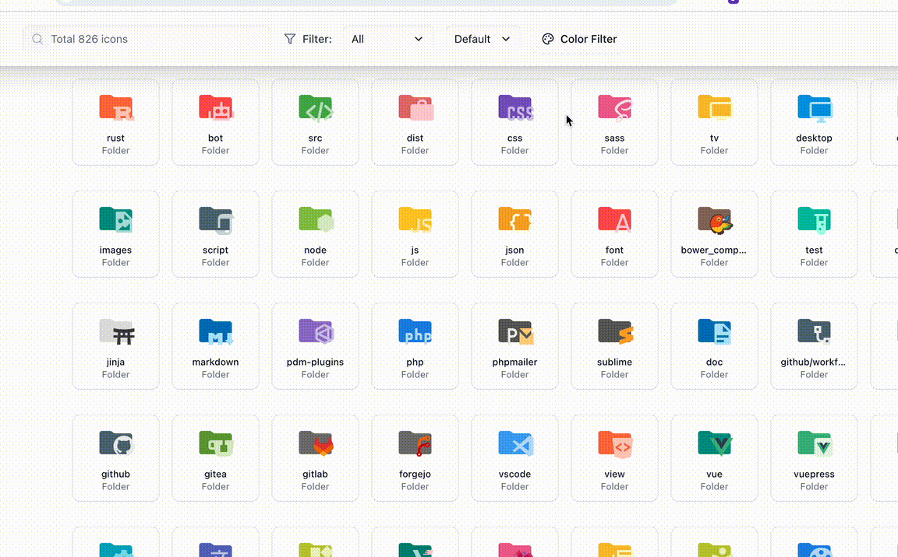
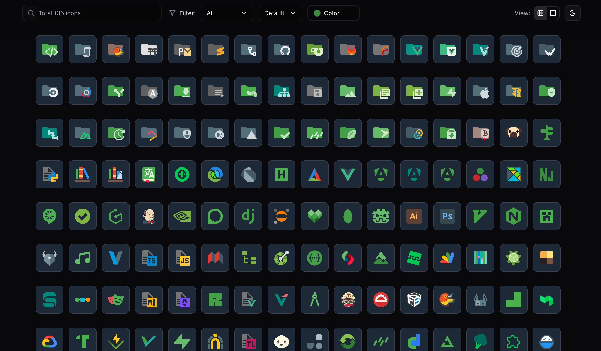

# Material Icon Preview Web

A web-based visual preview tool for VSCode Material Icon Theme extension. Help developers quickly browse, search, and use all available icons.

## 🌐 Live

**Try it now:** [https://vscode-material-icon-preview.vercel.app/](https://vscode-material-icon-preview.vercel.app/)

### 🎨 Color Filter in Action

*Advanced color picker with tolerance control - select any color and adjust the matching range to find icons with similar colors*

### 📱 Compact View & Large Display

*Small icon view mode allows you to see more icons at once while maintaining excellent visual clarity*


## 🎯 About This Project

VSCode Material Icon Theme is an excellent extension that provides beautiful icons for files and folders, but lacks an intuitive way to view all available icons and their association rules. This web tool perfectly solves this problem:

- **📁 826+ Icons Display**: Browse all icons in a clean grid layout
- **🔍 Smart Search**: Support fuzzy search to quickly find the icons you need
- **🏷️ Category Filtering**: Filter by file icons or folder icons
- **🎨 Color-Based Filtering**: Advanced color picker with tolerance range to find icons by color similarity
- **📋 One-Click Copy**: Click on an icon to copy its icon ID
- **🌓 Light/Dark Toggle**: Some icons support light/dark themes, hover over the icon to show the toggle button in the top right corner

## ✨ Core Features

### 🔍 Smart Fuzzy Search

- Support fuzzy search by icon name (e.g., "react", "python", "folder-src")
- Real-time search results without waiting

### 🏷️ Smart Category Filtering

- **File Icons**: Show all file type related icons
- **Folder Icons**: Show all folder related icons
- **Combined Filtering**: Support combination of search and category filtering

### 🎨 Advanced Color Filtering

- **Color Range Selection**: Click on the color picker to select from preset colors or input custom HEX values
- **Tolerance Control**: Adjust the color matching range with a slider (5%-50% tolerance)
- **Intelligent Algorithm**: Uses Euclidean distance in RGB color space to find icons with similar colors
- **Real-time Filtering**: Icons are filtered instantly based on the selected color and tolerance range
- **Visual Feedback**: Selected color is displayed with a preview circle and tolerance indicator

### 📋 Convenient Copy Function

- **Click to Copy**: Directly click on an icon to copy its icon ID to clipboard
- **Instant Feedback**: Show confirmation message after successful copy
- **Accurate Identifier**: Copy the exact identifier of the icon for direct use in development

### 🌓 Light/Dark Theme Support

- **Auto Detection**: Some icons have light/dark theme variants
- **Hover Hint**: When hovering over icons that support switching, a theme toggle button appears in the top right corner
- **Real-time Preview**: View the icon's appearance in different themes in real-time

## 🏗️ Tech Stack

### Project Structure

- **`dont-edit-me/vscode-material-icon-theme/`**: Cloned Material Icon Theme source code
- **`web/`**: React-based web application

### Technologies Used

- **Frontend Framework**: React 19 + TanStack Router
- **Styling**: Tailwind CSS + shadcn/ui component library
- **Package Manager**: Bun
- **Build Tool**: Vite
- **Deployment**: Vercel
- **Virtualization**: @tanstack/react-virtual (optimizes rendering performance for large number of icons)
- **Color Algorithm**: Custom Euclidean distance calculation in RGB color space for intelligent color matching

## 🚀 Local Development

### Prerequisites

- [Bun](https://bun.sh/) (recommended) or Node.js 18+

### Setup

```bash
# Clone the repository
git clone https://github.com/aqz236/vscode-material-icon-preview.git
cd vscode-material-icon-preview

# Install dependencies
bun install

# Start development server
bun dev
```

The web app will be available at `http://localhost:3000`

## 📄 License

This project is licensed under the MIT License - see the [LICENSE](LICENSE) file for details.

MIT License is a permissive open source license and one of the most commonly adopted open source licenses.

## 🙏 Acknowledgments

### Core Dependencies

- **[vscode-material-icon-theme](https://github.com/material-extensions/vscode-material-icon-theme)**: An excellent VSCode extension that brings visual enjoyment to developers, the core data source of this project
- **[TanStack](https://tanstack.com/)**: Provides powerful tech stack support, including Router and Virtual libraries
- **[Vercel](https://vercel.com/)**: Provides excellent online deployment services, allowing the project to run stably for free

### Technical Support

- **[shadcn/ui](https://ui.shadcn.com/)**: Beautiful UI component library
- **[Tailwind CSS](https://tailwindcss.com/)**: Utility-first CSS framework
- **[React](https://react.dev/)**: Powerful frontend framework
