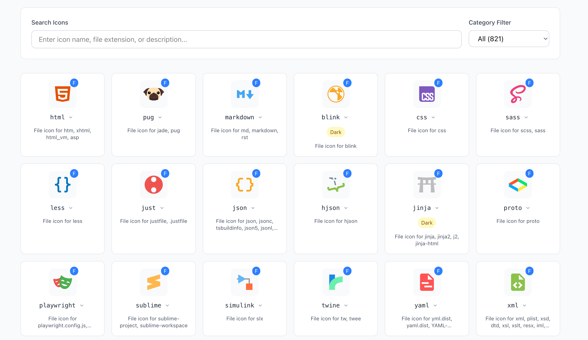

# Material Icon Preview Web

A web-based visual preview tool for all icons in the VSCode Material Icon Theme extension. This project allows you to browse, search, and copy icon names and their associated file extensions/folder names.

## 🌐 Live Demo

**Try it now:** [https://vscode-material-icon-preview.vercel.app/](https://vscode-material-icon-preview.vercel.app/)





## 🎯 Why This Project?

The VSCode Material Icon Theme is an amazing extension that provides beautiful icons for files and folders, but there's no easy way to visualize all available icons and their associations. This web tool solves that problem by providing:

- **Visual Icon Browser**: See all 1000+ icons in a clean grid layout
- **Smart Search**: Find icons by name, file extension, or folder name
- **Easy Copy**: Click to copy icon names or associated file patterns
- **Category Filtering**: Filter by file icons or folder icons
- **Light/Dark Variants**: View icons with light theme variants when available

## ✨ Features

### 🔍 Comprehensive Search

- Search by icon name (e.g., "react", "python", "folder-src")
- Search by file extension (e.g., ".js", ".py", ".md")
- Search by folder name (e.g., "node_modules", "src", "dist")

### 📋 Smart Copy Functionality

- **Hover on icon name**: Shows dropdown with all associated patterns
- **Click to copy**: Each extension/filename/folder name is individually copyable
- **Quick copy**: Click icon name to copy the icon identifier

### 🎨 Icon Categories

- **File Icons**: Icons for different file types and extensions
- **Folder Icons**: Icons for specific folder names and purposes

### 💡 Visual Indicators

- **Category badges**: F for files, D for folders
- **Light variants**: Toggle button for icons with light theme versions
- **Missing icons**: Clear indication when icon files are not found

## 🏗️ Technical Stack

This is a TurboRepo monorepo containing:

### Apps

- **`vscode-material-icon-theme/`**: Cloned Material Icon Theme source
- **`web/`**: React web application built with TanStack Router

### Technologies Used

- **Framework**: React 19 + TanStack Router
- **Styling**: Tailwind CSS + shadcn/ui components
- **Package Manager**: Bun
- **Build Tool**: Vite
- **Deployment**: Vercel

## 🚀 Local Development

### Prerequisites

- [Bun](https://bun.sh/) (recommended) or Node.js 18+

### Setup

```bash
# Clone the repository
git clone https://github.com/aqz236/vscode-material-icon-preview.git
cd vscode-material-icon-preview

# Install dependencies
bun install

# Start development server
cd apps/web
bun dev
```

The web app will be available at `http://localhost:3000`

### Development Commands

```bash
# Install dependencies for all packages
bun install

# Start web development server
cd apps/web && bun dev

# Build for production
cd apps/web && bun build

# Lint and format
cd apps/web && bun run lint
cd apps/web && bun run format
```

## 📁 Project Structure

```
material-icon-preview-web/
├── apps/
│   ├── vscode-material-icon-theme/     # Material Icon Theme source
│   │   ├── icons/                      # 1000+ SVG icon files
│   │   └── src/                        # TypeScript definitions
│   └── web/                            # React web application
│       ├── public/
│       │   └── icons/                  # Copied SVG files
│       ├── src/
│       │   ├── components/
│       │   │   └── IconGrid/          # Main UI components
│       │   ├── data/                   # Icon data processing
│       │   └── routes/                 # App routing
│       └── package.json
├── package.json                        # Root package.json
└── turbo.json                         # TurboRepo configuration
```

## 🎨 Icon Data Processing

The project processes icon definitions from the Material Icon Theme source:

1. **File Icons** (`fileIcons.ts`): Maps file extensions and names to icons
2. **Folder Icons** (`folderIcons.ts`): Maps folder names to icons
3. **Icon Processing** (`iconData.ts`): Extracts and normalizes all icon information

### Example Icon Data

```typescript
{
  name: "folder-node",
  category: "folder",
  folderNames: ["node", "nodejs", "node_modules"],
  description: "Folder icon for node, nodejs, node_modules"
}
```

## 🤝 Contributing

Contributions are welcome! This project helps developers working with the Material Icon Theme to quickly find and use the right icons.

### How to Contribute

1. Fork the repository
2. Create a feature branch (`git checkout -b feature/amazing-feature`)
3. Commit your changes (`git commit -m 'Add amazing feature'`)
4. Push to the branch (`git push origin feature/amazing-feature`)
5. Open a Pull Request

### Areas for Contribution

- UI/UX improvements
- Additional search functionality
- Performance optimizations
- Mobile responsiveness enhancements
- Icon metadata enrichment

## 📄 License

This project is licensed under the MIT License - see the [LICENSE](LICENSE) file for details.

## 🙏 Acknowledgments

- **[Material Icon Theme](https://github.com/material-extensions/vscode-material-icon-theme)**: The amazing VSCode extension that this tool showcases
- **[shadcn/ui](https://ui.shadcn.com/)**: For the beautiful UI components
- **[TanStack Router](https://tanstack.com/router)**: For the robust routing solution
- **[Tailwind CSS](https://tailwindcss.com/)**: For the utility-first CSS framework

## 🔗 Related Links

- [VSCode Material Icon Theme Extension](https://marketplace.visualstudio.com/items?itemName=PKief.material-icon-theme)
- [Material Icon Theme GitHub](https://github.com/material-extensions/vscode-material-icon-theme)
- [Live Preview Tool](https://vscode-material-icon-preview.vercel.app/)

---

Made with ❤️ to help developers find the perfect icons for their projects.
